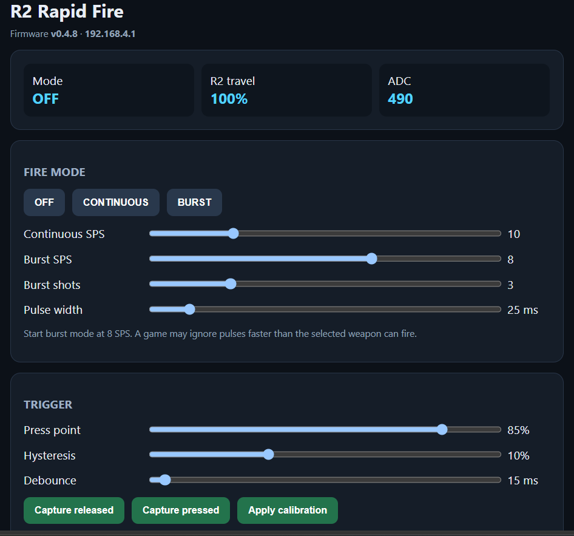
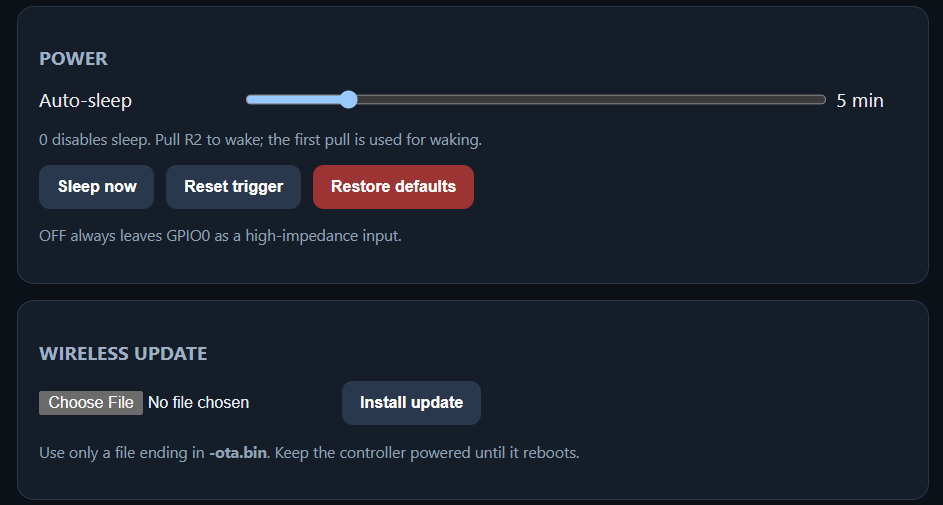

# PS5 DualSense R2 Rapid Fire (ESP32-C3)

ESP32-C3 Super Mini firmware for an existing DualSense R2 one-wire modification. It provides continuous and burst rapid-fire modes, trigger calibration, persistent settings, a local Wi-Fi dashboard, over-the-air updates, and automatic deep sleep.

Current release: **v0.4.8**

> [!CAUTION]
> This is an experimental hardware modification. It has not been electrically validated on every DualSense board revision. Verify voltages with a multimeter, use the required series resistor, and test on hardware you can afford to damage. Use may violate game, tournament, or platform rules.

## Features

- Continuous rapid fire from 1–40 shots per second (SPS)
- Burst rapid fire from 1–12 SPS with 1–10 shots
- Adjustable pulse width, press point, hysteresis, and debounce
- Released/pressed trigger calibration
- Browser dashboard served directly by the ESP32-C3
- Settings stored in non-volatile storage
- Dashboard-based OTA firmware updates
- Configurable automatic sleep and manual **Sleep now**

## Hardware and wiring

Required hardware:

- ESP32-C3 Super Mini
- 1 kΩ series resistor
- Existing access to the DualSense R2 signal, ground, and a suitable power source

```text
DualSense R2 signal pad --- 1 kΩ resistor --- GPIO0
DualSense ground ---------------------------- GND
Controller positive supply ----------------- 5V
```

Do not omit the 1 kΩ resistor. Confirm that the R2 signal stays within the ESP32-C3 input range before connecting it, and always share ground.

Do not connect controller battery power and USB 5 V simultaneously unless you have verified safe power-path isolation. For initial testing, power the ESP32-C3 over USB and connect only the R2 signal and controller ground.

## Build and flash

Install [PlatformIO](https://platformio.org/), open this repository, and run:

```sh
pio run -e esp32-c3-super-mini
pio run -e esp32-c3-super-mini --target upload
pio device monitor
```

The build uses the Arduino-ESP32 3.x-compatible PioArduino platform specified in [`platformio.ini`](platformio.ini). See [Building and releasing](docs/BUILDING_AND_RELEASING.md) for artifact locations, OTA guidance, and the release workflow.

Ready-to-flash v0.4.8 factory and OTA images are attached to the [GitHub release](../../releases/tag/v0.4.8). Flash the factory image at offset `0x0`. Devices already running v0.4.2 or newer can install the `-ota.bin` image from the dashboard.

## First-time setup

After boot, connect to:

- Wi-Fi network: `R2-RapidFire`
- Default password: `12345678`
- Dashboard: `http://192.168.4.1`

Change `AP_PASSWORD` in [`src/main.cpp`](src/main.cpp) before regular use.

1. Select **OFF**.
2. Leave R2 completely released and select **Capture released**.
3. Hold R2 fully down and select **Capture pressed**.
4. Select **Apply calibration**.
5. Start at 8–10 SPS with a 25–35 ms pulse width.





OFF mode keeps GPIO0 as a high-impedance input so normal R2 operation passes through unchanged. During firing, the firmware briefly drives the signal through the resistor, then releases the pin to sample the physical trigger.

## Sleep behavior

The default auto-sleep timeout is five minutes without meaningful trigger activity. Set it to `0` to disable automatic sleep. While asleep, the firmware polls the analog R2 signal every 250 ms; hold R2 for roughly half a second to wake it. The first pull is consumed by waking.

The controller must be powered for its R2 sensor to provide a valid reading. The Super Mini regulator and power LED still consume current during deep sleep.

## Repository layout

```text
include/web_ui.h                 Embedded dashboard
src/main.cpp                     Firmware and firing state machine
docs/                            Screenshots and maintenance guidance
platformio.ini                   Board, framework, and build configuration
HANDOFF.md                       Detailed engineering handoff notes
RELEASE_NOTES.md                 Version history and known bad versions
```

The separate website is intentionally not part of this repository. Generated `.bin` files are published as GitHub release assets instead of being committed to source control.

## Known limitations

- The one-wire design cannot drive the controller-facing signal and independently read the physical trigger at the same instant.
- High SPS values may be ignored by games whose weapons have a lower firing cadence.
- v0.4.4 and v0.4.6 contain known regressions; use v0.4.8 or the v0.4.3 rollback image.

For deeper implementation notes and suggested next work, see [`HANDOFF.md`](HANDOFF.md). For release history, see [`RELEASE_NOTES.md`](RELEASE_NOTES.md).
